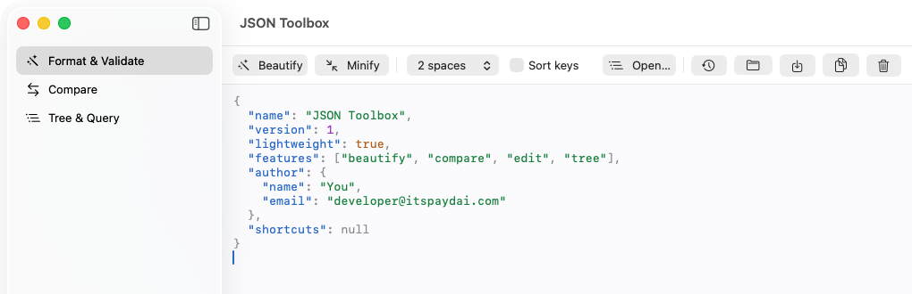
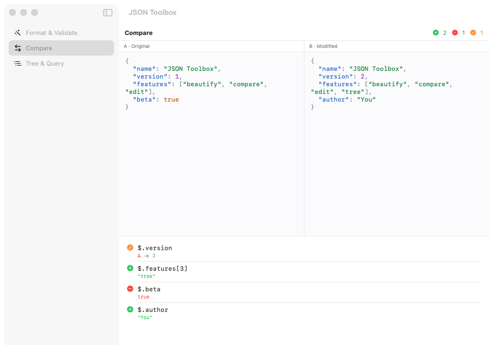
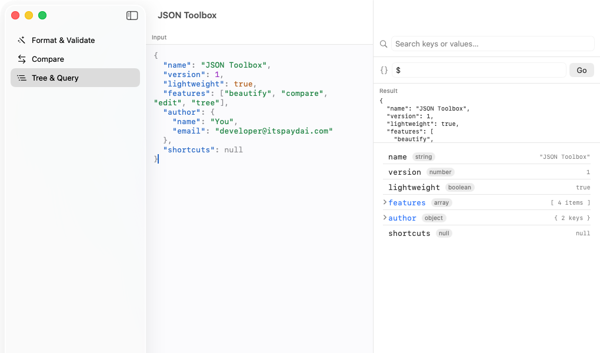
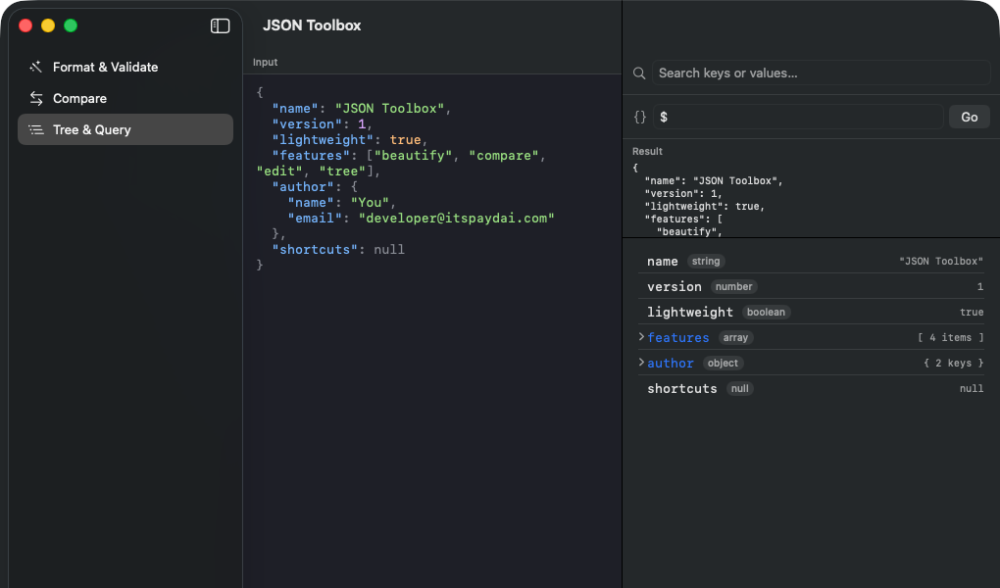

# JSON Toolbox

A lightweight, **native macOS** app to **beautify, compare, edit, and explore JSON** — built with
SwiftUI + AppKit and Swift Package Manager. No Electron, no bundled browser: a few-MB binary that
launches instantly.


> Built entirely with Swift Package Manager — **no Xcode project required**, just the Swift
> toolchain (Command Line Tools is enough).

## Screenshots

_Coming soon._ (See [`docs/screenshots/`](docs/screenshots).)

<!--




-->

## Features

| Tab | What it does |
| --- | --- |
| **Format & Validate** | Pretty-print / minify, configurable indent (2 / 4 / tab), optional key sorting, live validation with exact `line:column` error reporting, open / save / copy, **Open in Tree**, and a persistent **History** of pasted / opened documents. |
| **Compare** | Side-by-side editors with a structural, path-based diff — added / removed / changed leaves, order-independent for object keys. Numeric equality aware (`2.50` == `2.5`). |
| **Tree & Query** | Collapsible tree view with type badges, a **search** across all keys and values, and a small JSONPath-style query (`$.author.name`, `features[0]`, `["odd key"]`). The result pane height is draggable. |

Other niceties:

- **Syntax-highlighted editor** (real `NSTextView`): monospaced, native ⌘F find bar, themed for light & dark.
- **Light / System / Dark** appearance switch, remembered across launches.
- **Persistent history** kept until you delete it (see below).
- **Order-preserving JSON engine**: a hand-written parser keeps object key order and the exact text
  of numbers (`1.0`, `6.022e23`, large integers round-trip losslessly) and reports precise error
  locations.

## Requirements

- macOS 13 (Ventura) or later
- Swift toolchain — **full Xcode not required**; Command Line Tools is enough

Check with `swift --version`.

## Build & run

```sh
make run     # build a JSONToolbox.app bundle and open it
make app     # just build the .app bundle
make dev     # fast run straight from SwiftPM (no bundle)
make clean
```

To install, drag the generated `JSONToolbox.app` into `/Applications`.

> The app is unsigned. On first launch, right-click the app → **Open**, or allow it under
> System Settings → Privacy & Security.

## History

The Format tab keeps a history of documents you paste, open, or explicitly save. It persists to
`~/Library/Application Support/JSONToolbox/history.json` and is kept until you delete entries (per
row) or **Clear All** — nothing is auto-expired. Identical documents are de-duplicated (the
existing entry moves to the top). Open it from the clock button in the Format toolbar.

## Project layout

```
Sources/JSONToolbox/
  JSONToolboxApp.swift      App entry point
  AppState.swift            Shared buffers, selected tab, formatting options
  Core/                     Pure logic (no UI) — easy to unit-test or reuse
    JSONValue.swift         Order-preserving JSON model
    JSONParser.swift        Hand-written parser with error locations
    JSONFormatter.swift     Pretty-print / minify
    JSONDiff.swift          Structural diff
    JSONTree.swift          Tree model builder
    JSONQuery.swift         Path query evaluator
    JSONSearch.swift        Key/value search
  Editor/                   NSTextView-backed editor
    CodeEditor.swift
    JSONSyntaxHighlighter.swift
  Support/                  Palette, sample data, history store
  Views/                    SwiftUI screens (Content, Format, Compare, Tree, History)
```

The `Core/` layer has no UI dependencies, so it can be compiled and tested with `swiftc` alone.

## Contributing

Issues and PRs are welcome. To get started:

```sh
git clone https://github.com/divaymohan/json-toolbox.git
cd json-toolbox
make dev
```

Keep new pure logic in `Core/` (UI-free) so it stays testable.

## License

[MIT](LICENSE) © 2026 divaymohan
